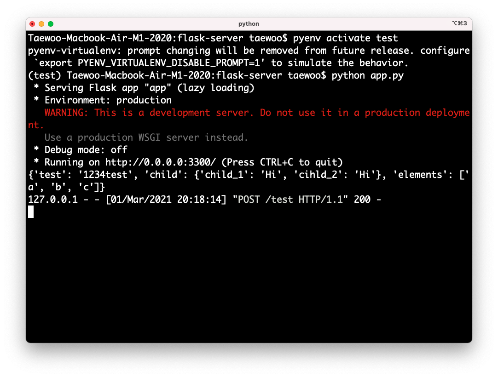
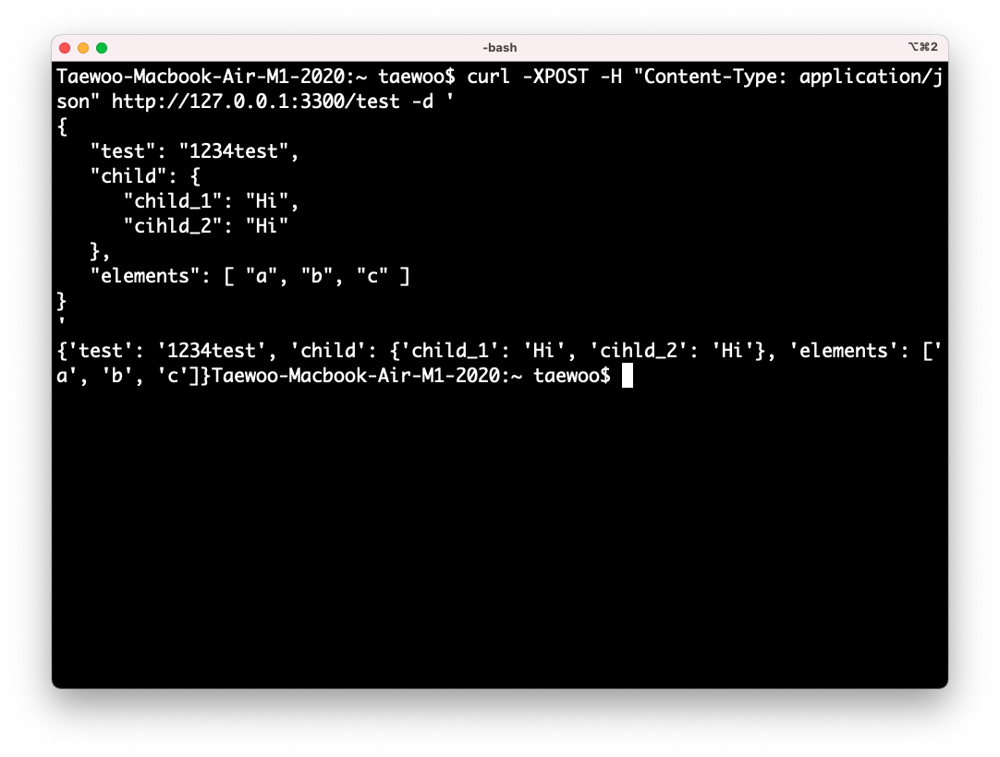

# flask-server

- For server usage
- First draft is for simple request-response test.

## Environment

- Python 3.X
- Flask

## Installation

```
pip install Flask
```

## Run

- Server

```
python app.py
```

- Client
- Other calls(apis, etc..) are also available

```
curl -XPOST -H "Content-Type: application/json" http://127.0.0.1:3300/test -d '
{
   "test": "1234test",
   "child": {
      "child_1": "Hi",
      "cihld_2": "Hi"
   },
   "elements": [ "a", "b", "c" ]
}
'
```

## Examples

<div style="text-align:center">
</div>

<div style="text-align:center">
</div>
